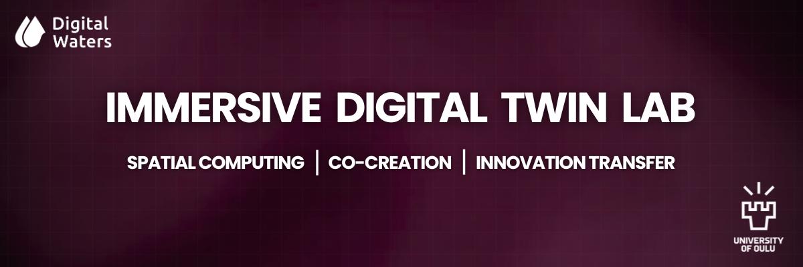

<h2 align="center">IMMERSIVE DIGITAL TWIN LAB</h2>

🌐 *The Immersive Digital Twin Lab leverages cutting-edge XR (Extended Reality) technologies, AI, and cloud-based platforms to create fully interactive digital representations of water and environmental systems within the DIWA project. By integrating immersive visualization, real-time data streams, and AI-assisted analytics, stakeholders can explore, analyze, and interact with complex infrastructures in ways that were previously impossible. XR-enabled digital twins facilitate collaborative decision-making, scenario testing, and predictive modeling, allowing project partners, researchers, and policymakers to better understand environmental processes, optimize resource management, and co-create innovative solutions. This approach not only enhances transparency and engagement but also accelerates the translation of data into actionable insights for sustainable water and environmental management.*

  

<h2 align="center">Overview</h2>

The **Immersive Digital Twin Lab** is established at the **University of Oulu**, within the **Department of Technology** and **WE3 Unit**, as part of the **Digital Waters Flagship** program. The lab focuses on virtualising digital twins and making them accessible through **immersive XR-based experiences**, supporting stakeholder collaboration and co-creation of services.

*Our mission is to enable scalable, interoperable, and collaborative digital twin experiences through open-source technologies, cloud platforms, XR interfaces, and data-driven workflows.*

<h2 align="center">Core Objectives</h2>

### Virtualising Digital Twins for immersive experiences
- Transform digital twins from technical models into interactive, human-centered platforms  
- Integrate XR (AR/VR/MR) for real-time visualization and interaction  
- Support collaborative decision-making and stakeholder engagement  

### Enable interoperable and scalable digital solutions
- Build cloud-based, modular architectures  
- Integrate IoT and sensor networks with real-time simulation pipelines  
- Promote **FAIR** (Findable, Accessible, Interoperable, Reusable) principles  
- Foster collaboration across disciplines — from architecture, engineering, and construction to urban planning  

<h2 align="center">Organizational Structure</h2>

*The lab operates primarily under **RT4: Digital Services, Platforms, and Business Applications**, in collaboration with other research themes (RT4: Digital services, platforms, and business applications | Interoperable digital solutions for sharing and exploring data, and co-creation of services)*

XR Services</h2>

| XR Service | Description |
|------------|-------------|
| [DT Integration](docs/xr-roadmap.md#dt-integration) | *Connect VR app to DIWA Digital Twin backend for synchronized model & sensor data.* |
| [WebGIS Interop](docs/xr-roadmap.md#webgis-interop) | *Seamless integration with ArcGIS Pro, Enterprise, and Online; 2D dashboards ↔ 3D immersive exploration.* |
| [3D Sim & Design](docs/xr-roadmap.md#3d-sim-design) | *Immersive VR environments in Unity, Cesium, and ArcGIS SDKs for city-scale hydrological & spatial simulations.* |
| [Collaborative VR](docs/xr-activities.md#collaborative-vr) | *Multi-user VR sessions for co-exploration, participatory planning, and stakeholder engagement.* |
| [AI Assistant](docs/xr-activities.md#ai-assistant) | *Generative AI assistants for natural-language queries, scenario explanations, and interactive model exploration.* |

*The Immersive Digital Twin Lab leverages these XR services to demonstrate and explore supersites and real-world use cases. XR demonstrations will initially be conducted in **VR environments** (3DoF, 6DoF, tabletop, 1:1 scale) to provide fully immersive, interactive experiences. Subsequently, these experiences will be extended to **Mixed Reality (MR) and Augmented Reality (AR) devices**, enabling multi-scale visualization, collaborative exploration, and stakeholder engagement across diverse digital twin scenarios.*

<h2 align="center">Key Technologies</h2>

We build upon open, scalable, and interoperable architectures, including:

- **Game & XR Engines:** Unity3D, Unreal Engine  
- **GIS & Digital Twin Platforms:** ArcGIS Pro, ArcGIS Enterprise, ArcGIS Online, QGIS  
- **Cloud Platforms:** AWS, Azure for XR visualization and real-time data streaming  
- **XR Devices & Interfaces:** HoloLens 2, Meta Quest 3, Magic Leap 2, WebXR  

<h2 align="center">Getting Started</h2>

Learn about our Immersive Digital Twin Lab architectures and XR workflows:

- Explore XR-enabled digital twin environments  
- Access modular data and model pipelines  
- Follow standards for reproducible repository and project management  

<h2 align="center">Access the Immersive Digital Twin Lab</h2>

- **IDT Lab:** *Email <a href="mailto:siamak.bazzaz@oulu.fi">siamak.bazzaz@oulu.fi</a> to request access*  
- **Share and publish data:** *Upload models, scans, and XR assets for collaborative use (coming soon)*  

<h2 align="center">Explore our repositories (coming soon)</h2>

Visit our public repositories to discover ongoing XR and digital twin projects.  

<h2 align="center">Join the Discussion</h2>

Participate in our GitHub Discussions to collaborate on immersive digital twin topics. Current discussion threads include:

- **[Stakeholder Collaboration in Immersive Digital Twins](https://github.com/SiamakAB/immersive-digital-twin-lab/discussions/1)**  
  *Share ideas and feedback on how stakeholders can engage with experts, co-design XR environments, and contribute to the development of immersive digital twin solutions.*

- **[XR Commercialization and Funding Opportunities](https://github.com/SiamakAB/immersive-digital-twin-lab/discussions/2)**  
  *Discuss strategies for XR commercialization, potential funding sources at Finnish or EU levels, and ways to support the DIWA program through innovative applications and partnerships.*

Contribute your insights, ask questions, and help shape the future of the Immersive Digital Twin Lab!

<h2 align="center">Contribute (coming soon)</h2>

<ul>
  <li>Review our <strong>Contributing Guidelines</strong></li>
  <li>Read the <strong>Code of Conduct</strong>  
    👉 <a href="CODE_OF_CONDUCT.md">CODE_OF_CONDUCT.md</a>
  </li>
  <li>Open issues, propose features, or submit pull requests</li>
  <li>Collaborate on <strong>digital twin and XR use cases</strong></li>
</ul>

<h2 align="center">Additional Resources</h2>

<ul>
  <li>
    <strong>Data requirements for immersive demonstrations</strong> 
    For information on the types of data to be shared with the Immersive Digital Twin Lab for XR-based demonstrations, please refer to: 
    👉 <a href="docs/data-requirements.md">docs/data-requirements.md</a>
  </li>
   
  <li>
    <strong>Proposed XR roadmap and future planning</strong> 
    For the planned/proposed XR development roadmap and long-term objectives for XR integration, please see: 
    👉 <a href="docs/xr-roadmap.md">docs/xr-roadmap.md</a>
  </li>
   
  <li>
    <strong>XR Activities and Implementation</strong> 
    For concrete activities supporting the XR roadmap—including workshops, newsletters, demo days, online courses, and infrastructure development—please see: 
    👉 <a href="docs/xr-activities.md">docs/xr-activities.md</a>
  </li>
   
  <li>
    <strong>Digital Waters GitHub organization</strong> 
    To explore repositories, tools, and digital twin initiatives developed within the Digital Waters Flagship, visit: 
    👉 <a href="https://github.com/DigitalWaters-fi">DigitalWaters-fi on GitHub</a>
  </li>
</ul>

<h2 align="center">Citation & Attribution (coming soon)</h2>

*If you use our frameworks, models, or XR platforms in your research, please cite the repository via Zenodo. For publications and methodology details, see our **publications page**.*

<h2 align="center">Contact</h2>

Questions, suggestions, or collaboration inquiries are welcome: <a href="mailto:siamak.bazzaz@oulu.fi">siamak.bazzaz@oulu.fi</a>

---

⚠️ ***This page is under construction** and will be officially launched in **February 2026**. All ideas, suggestions, and feedback are welcome — your contributions are highly appreciated!*
